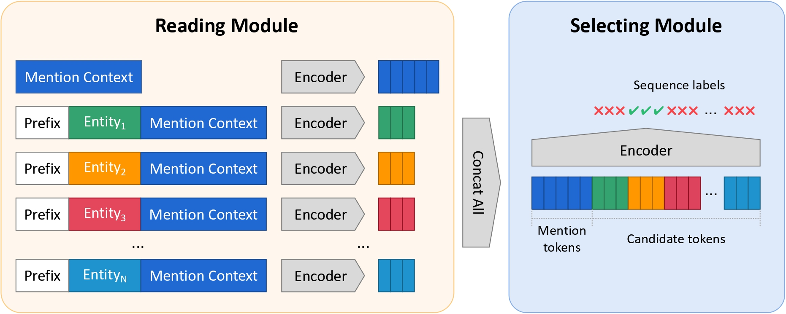

# read-and-select
<p align="center">
  
</p>

### Environment
```
conda activate -n res python=3.9
conda activate res
pip install -r requirements.txt
```
### Data and Checkpoints
Please see the `README.md` files in different folders to download the corresponding data and checkpoints.

### Evaluate with Our Checkpoints
After downloading the data and checkpoints, you can use the command below to replicate our results reported in the paper.
```
python run_disambiguation_attention.py --do_eval \
--model model_disambiguation/zeshel_disambiguation_attention.pt \
--transformer_model roberta-base \
```

### Train Res
You can train your own model with the command below.
```
python run_disambiguation_attention.py --do_eval \
--do_train \
--model model_disambiguation/zeshel_disambiguation_attention.pt \
--transformer_model roberta-base \
--cand_num 10
--batch 4
--gpus 0,1,2,3
```
🚨: if you follow our experiment setting to set `cand_num=56`, it takes 4*40G A-100.
